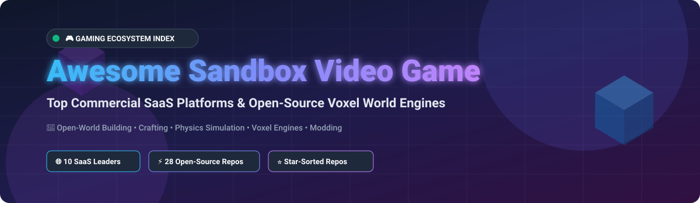

  

# 🎮 Awesome Sandbox Video Game 🕹️

## 🌌 Top Sandbox Video Game Ecosystem & Open-Source Voxel World Engines

  
  
  
  

---

### 📌 Overview & Market Context
Welcome to the definitive curated directory of **sandbox video games**, **hosted user-generated content (UGC) platforms**, and **open-source voxel world game engines**. Sandbox video games empower players with creative freedom—enabling infinite building, crafting, procedural exploration, physics simulation, and modding with minimal linear constraints.

> 📊 **Market Size & Structure**: The global Sandbox and User-Generated Content (UGC) gaming sector is estimated at **$22.5 Billion in 2026** (projected to reach $45 Billion by 2030 at a 15.2% CAGR). The market structure is **highly concentrated (winner-take-all dynamics)** at the platform level—where top giants like Roblox and Minecraft capture over 70% of total player engagement and UGC monetization—yet **moderately fragmented** across niche sub-genres (physics simulators, space mechanics, and indie survival sandboxes).

---

## 📑 Table of Contents
- [👑 Commercial / SaaS Hosted Platforms](#-commercial--saas-hosted-platforms)
- [🔓 Open-Source GitHub Projects](#-open-source-github-projects)
- [🤝 How to Contribute](#-how-to-contribute)
- [⚠️ Disclaimer](#-disclaimer)
- [⭐ Star History](#-star-history)
- [💖 Support & Sponsorship](#-support--sponsorship)

---

## 👑 Commercial / SaaS Hosted Platforms

Below is a curated list of top commercial sandbox games and UGC game creation platforms, sorted by **Revenue / Valuation (Descending)**:

| Platform 🎮 | Description 📝 | Revenue / Valuation 💰 | Starting Price 🏷️ | Free Tier Limit / Free Trial 🎁 |
| :--- | :--- | :--- | :--- | :--- |
| **[Roblox](https://www.roblox.com/)** | Leading user-generated gaming & creation platform with 70M+ daily active users powered by Roblox Studio & Lua scripting. | **$2.80 Billion Revenue** (Annual 2025/2026) | $4.99/mo (Premium 450 Robux) | Free forever with full playing & Roblox Studio creation access; 30% developer revenue fee |
| **[Minecraft](https://www.minecraft.net/)** | The best-selling video game of all time (300M+ copies sold) featuring procedurally generated block worlds and Redstone logic. | **$380 Million Revenue** (Annual estimated) | $29.99 one-time buy (Bedrock & Java) | Free 100-minute trial on Android/PC demo world |
| **[Subnautica](https://unknownworlds.com/subnautica/)** | Story-rich underwater survival sandbox with deep base building, submarine crafting, and alien ocean exploration. | **$250 Million Revenue** (Lifetime estimated) | $29.99 one-time purchase | No free tier; 2-hour free refund window on Steam |
| **[No Man's Sky](https://www.nomanssky.com/)** | Procedurally generated universe sandbox with 18 quintillion planets, space combat, base building, and cross-play multiplayer. | **$200 Million Revenue** (Lifetime estimated) | $59.99 one-time purchase | No free trial; periodic free play weekend events on Steam/Consoles |
| **[Terraria](https://terraria.org/)** | Action-packed 2D procedural sandbox adventure featuring mining, crafting, boss battles, and town construction. | **$150 Million Revenue** (50M+ copies sold) | $9.99 one-time purchase | Free lite demo version available on mobile devices |
| **[Valheim](https://www.valheimgame.com/)** | Co-op Viking survival & exploration sandbox set in procedurally generated Norse purgatory with physics-based building. | **$120 Million Revenue** (12M+ copies sold) | $19.99 one-time purchase | No free trial; 2-hour refund policy via Steam |
| **[Garry's Mod](https://gmod.playershops.com/)** | Iconic Source engine physics sandbox allowing players to manipulate objects, craft contraptions, and write custom Lua game modes. | **$100 Million Revenue** (20M+ copies sold) | $9.99 one-time purchase | No free trial; 2-hour standard Steam refund policy |
| **[Kerbal Space Program](https://www.kerbalspaceprogram.com/)** | Realistic physics-based spaceflight & rocket engineering sandbox with orbital mechanics and aerodynamics. | **$80 Million Revenue** (Lifetime estimated) | $39.99 one-time purchase | Free playable demo available on Steam & official website |
| **[Starbound](https://playstarbound.com/)** | 2D pixel space sandbox RPG with infinite planet exploration, space station crafting, and alien colonizing. | **$50 Million Revenue** (Lifetime estimated) | $14.99 one-time purchase | No free trial; 2-hour Steam refund policy |
| **[Scrap Mechanic](https://scrapmechanic.com/)** | Mechanical & vehicle engineering sandbox where players design animated contraptions, rovers, and automated machinery. | **$30 Million Revenue** (Lifetime estimated) | $19.99 one-time purchase | No free trial; 2-hour Steam refund policy |

---

## 🔓 Open-Source GitHub Projects

Explore top community-driven, open-source sandbox game engines, transport simulators, and voxel projects, sorted by **GitHub Stars_Count (Descending)**:

| Repository / Project 🚀 | Stars_Count 🌟 | License 📜 | Description & Key Features 🛠️ |
| :--- | :--- | :--- | :--- |
| **[Luanti (formerly Minetest)](https://github.com/luanti-org/luanti)** |  | LGPL-2.1 | De facto open-source voxel game engine with C++ core, Lua API, multi-platform support, and vast modding ecosystem. |
| **[Cataclysm: Dark Days Ahead](https://github.com/CleverRaven/Cataclysm-DDA)** |  | CC-BY-SA-3.0 | Turn-based post-apocalyptic survival sandbox roguelike featuring deep crafting, vehicle building, and infinite simulation. |
| **[OpenRCT2](https://github.com/OpenRCT2/OpenRCT2)** |  | GPL-3.0 | Open-source re-implementation of RollerCoaster Tycoon 2 with multiplayer support, high-res graphics, and custom park building. |
| **[Veloren](https://github.com/veloren/veloren)** |  | GPL-3.0 | Multiplayer voxel RPG sandbox written in Rust, inspired by Cube World and Legend of Zelda with procedural world generation. |
| **[OpenTTD](https://github.com/OpenTTD/OpenTTD)** |  | GPL-2.0 | Open-source transport management simulation sandbox replicating and expanding Transport Tycoon Deluxe with online multiplayer. |
| **[Endless Sky](https://github.com/endless-sky/endless-sky)** |  | GPL-3.0 | 2D space trading and combat sandbox game reminiscent of the classic Escape Velocity series. |
| **[Terasology](https://github.com/MovingBlocks/Terasology)** |  | Apache-2.0 | Highly modular Java voxel world engine designed for extensibility, research, and procedural sandbox gameplay. |
| **[The Powder Toy](https://github.com/The-Powder-Toy/The-Powder-Toy)** |  | GPL-3.0 | Desktop falling-sand physics sandbox simulating air pressure, velocity, heat, gravity, and chemical reactions. |
| **[OpenRA](https://github.com/OpenRA/OpenRA)** |  | GPL-3.0 | Open-source Real-Time Strategy (RTS) engine supporting classic Command & Conquer series with map editing & modding. |
| **[SuperTuxKart](https://github.com/supertuxkart/stk-code)** |  | GPL-3.0 | 3D open-source arcade kart racing game with track creation tools, battle modes, and network play. |
| **[OpenMW](https://github.com/OpenMW/openmw)** |  | GPL-3.0 | Open-source RPG engine recreation for The Elder Scrolls III: Morrowind, extending sandbox modding limits. |
| **[DevilutionX](https://github.com/diasurgical/devilutionX)** |  | Unlicense | Cross-platform engine port of Diablo and Hellfire, enabling modern multiplayer & touch controls. |
| **[0 A.D.](https://github.com/0ad/0ad)** |  | GPL-2.0 | Historical real-time strategy & empire building sandbox focusing on ancient warfare and economic management. |
| **[MineClone2](https://github.com/mineclone2/mineclone2)** |  | GPL-3.0 | Comprehensive Minecraft-like survival & crafting game environment built directly on the Luanti engine. |
| **[Pioneer](https://github.com/pioneerspacesim/pioneer)** |  | GPL-3.0 | Space exploration sandbox featuring seamless planetary landings, Newtonian physics, and galactic trade. |
| **[Rigs of Rods](https://github.com/RigsOfRods/rigs-of-rods)** |  | GPL-3.0 | Soft-body physics vehicle simulator sandbox for driving trucks, aircraft, and boats with realistic destruction. |
| **[Widelands](https://github.com/widelands/widelands)** |  | GPL-2.0 | Real-time economic management and settlement building sandbox game inspired by Settlers II. |
| **[Simutrans](https://github.com/simutrans/simutrans)** |  | Artistic-2.0 | Transportation simulation game where players construct networks to move passengers, mail, and industrial freight. |
| **[Xonotic](https://gitlab.com/xonotic/xonotic)** |  | GPL-3.0 | Fast-paced arena FPS with extensive map maker tools and sandbox community gameplay modes. |
| **[Flare Engine](https://github.com/flareteam/flare-engine)** |  | GPL-3.0 | 2D isometric action RPG game engine created for clean modding and customized sandbox RPG campaigns. |
| **[FreedroidRPG](https://gitlab.com/freedroid/freedroid-src)** |  | GPL-2.0 | Sci-fi isometric action RPG featuring hacking mechanics, customizable equipment, and robot combat. |
| **[Sauerbraten](https://github.com/sauerbraten/cube2)** |  | Zlib | Cube 2 engine-powered FPS featuring real-time in-game cooperative 3D level geometry editing. |
| **[Red Eclipse](https://github.com/redeclipse/deploy)** |  | Zlib | Parkour-focused arena shooter built on Cube 2 engine with integrated multiplayer map building. |
| **[VoxeLibre (VoxeLibre/VoxeLibre)](https://github.com/VoxeLibre/VoxeLibre)** |  | GPL-3.0 | Active community sandbox game for Luanti (formerly MineClone2 fork) focusing on survival crafting. |
| **[Sonic Robo Blast 2](https://github.com/STJr/SRB2)** |  | GPL-2.0 | 3D Sonic the Hedgehog platformer sandbox fan-game built on a heavily modified Doom Legacy engine. |
| **[NodeCore](https://codeberg.org/nodecore/nodecore)** |  | GPL-3.0 | Surreal, hands-on voxel sandbox game for Luanti emphasizing puzzle-like node discovery and crafting. |
| **[Mineclonia](https://codeberg.org/mineclonia/mineclonia)** |  | GPL-3.0 | Lightweight, performance-focused voxel survival game for Luanti emphasizing stability and clean code. |

---

## 🤝 How to Contribute

We welcome community contributions! Follow these steps to submit additions or updates:

1. **Fork** the repository.
2. Edit `README.md` following the tabular schema.
3. Ensure open-source projects include official repository links, correct licensing, and Stars_Counts.
4. Submit a **Pull Request** with a brief summary of additions.

---

## ⚠️ Disclaimer

- This list is **community-curated** for educational, developer, and research purposes.
- Always verify mod security and asset licenses when running open-source or commercial game servers.
- Some open-source engine reimplementations (e.g., OpenMW, OpenRCT2) require original proprietary game data files to play full campaigns.

---

## ⭐ Star History

---

## 💖 Support & Sponsorship

If you find this repository valuable for discovering sandbox gaming engines, research, or game development, please consider showing your support:

- ⭐ **Star** this repository to increase visibility!
- 🔀 **Fork** and contribute new tools or updates.
- 📢 **Share** with game developers and voxel sandbox enthusiasts.
- ☕ **Buy me a coffee**: Support ongoing open-source curation on the [GitHub Sponsor Dashboard](https://github.com/sponsors/ishandutta2007).

---
*Maintained with ❤️ by [ishandutta2007](https://github.com/ishandutta2007).*
